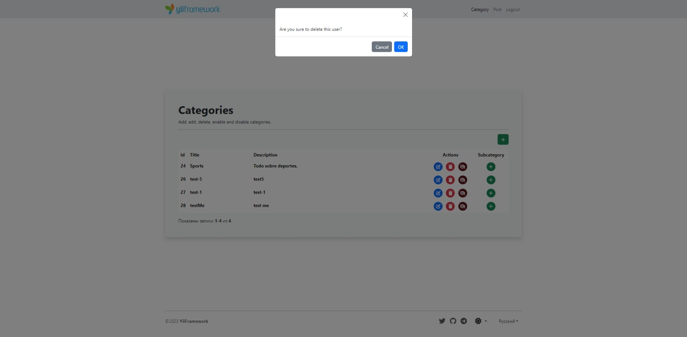

<p align="center">
    <a href="https://github.com/yii2-extensions/asset-bootbox" target="_blank">
        
    </a>
    <h1 align="center">Asset for Bootbox.</h1>
    <br>
</p>

<p align="center">
    <a href="https://www.php.net/releases/8.1/en.php" target="_blank">
        
    </a>
    <a href="https://github.com/yii2-extensions/asset-bootbox/actions/workflows/build.yml" target="_blank">
        
    </a>
    <a href="https://codecov.io/gh/yii2-extensions/asset-bootbox" target="_blank">
        
    </a>
    <a href="https://dashboard.stryker-mutator.io/reports/github.com/yii2-extensions/asset-bootbox/main" target="_blank">
        
    </a>               
</p>



## Installation

The preferred way to install this extension is through [composer](https://getcomposer.org/download/).

Either run

```
composer require --dev --prefer-dist yii2-extensions/asset-bootbox
```

or add

```
"yii2-extensions/asset-bootbox": "dev-main"
```

to the require-dev section of your `composer.json` file.    

## Usage

```php
<?php

declare(strict_types=1);

use Yii2\Asset\BootboxAsset;
use yii\helpers\Html;

BootboxAsset::register($this);

echo Html::a(
    'Delete',
    '#',
    [
        'class' => 'btn btn-danger',
        'data' => [
            'confirm' => 'Are you sure you want to delete this item?',
            'method' => 'post',
        ],
    ]
);
```

## Quality code

[](https://github.com/yii2-extensions/asset-bootbox/actions/workflows/static.yml)
[](https://github.com/yii2-extensions/asset-bootbox/actions/workflows/static.yml)
[](https://github.styleci.io/repos/193722479?branch=main)

## Support versions Yii2

[](https://github.com/yiisoft/yii2/tree/2.0.49.3)
[](https://github.com/yiisoft/yii2/tree/2.2)

## Testing

[Check the documentation testing](/docs/testing.md) to learn about testing.

## Our social networks

[](https://twitter.com/Terabytesoftw)

## License

The MIT License. Please see [License File](LICENSE.md) for more information.
 